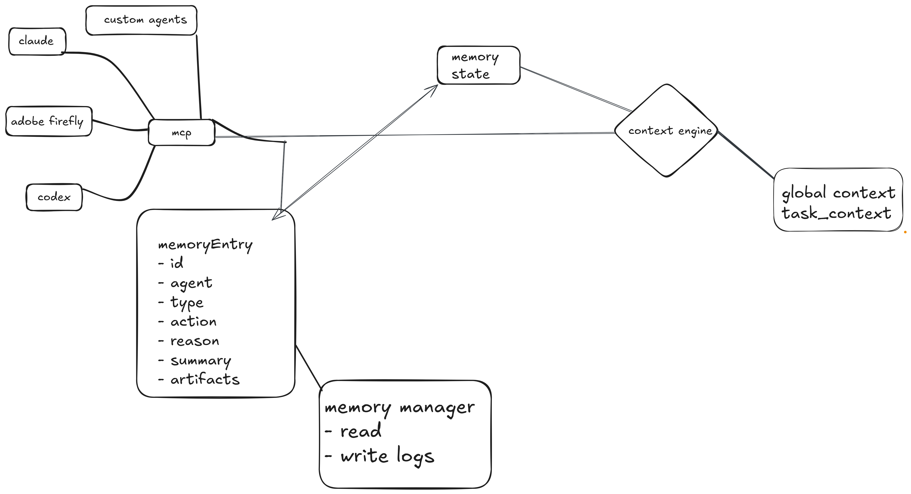

#  Context-Span
**context-span** is semantic memory and context retrieval layer for AI agents 
Agents can store decisions, summaries, artifacts and reasoning in a shared memory space.

#### Why
AI agents lose context across sessions, tools and providers.
Context-Span provides persistent, retrievable memory independent of the underlying model.

### Arhitecture


### Installation
```
uv sync
ollama pull nomic-embed-text
uv run main.py
```

### Retrieval flow
```Query
↓
Embedding
↓
Vector Search
↓
Relevant Logs
↓
Context
```
